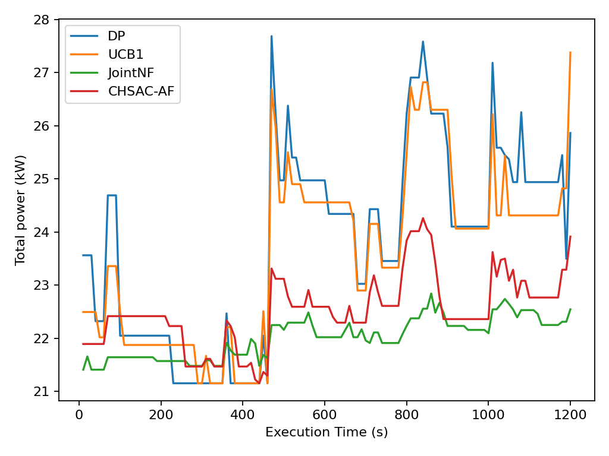
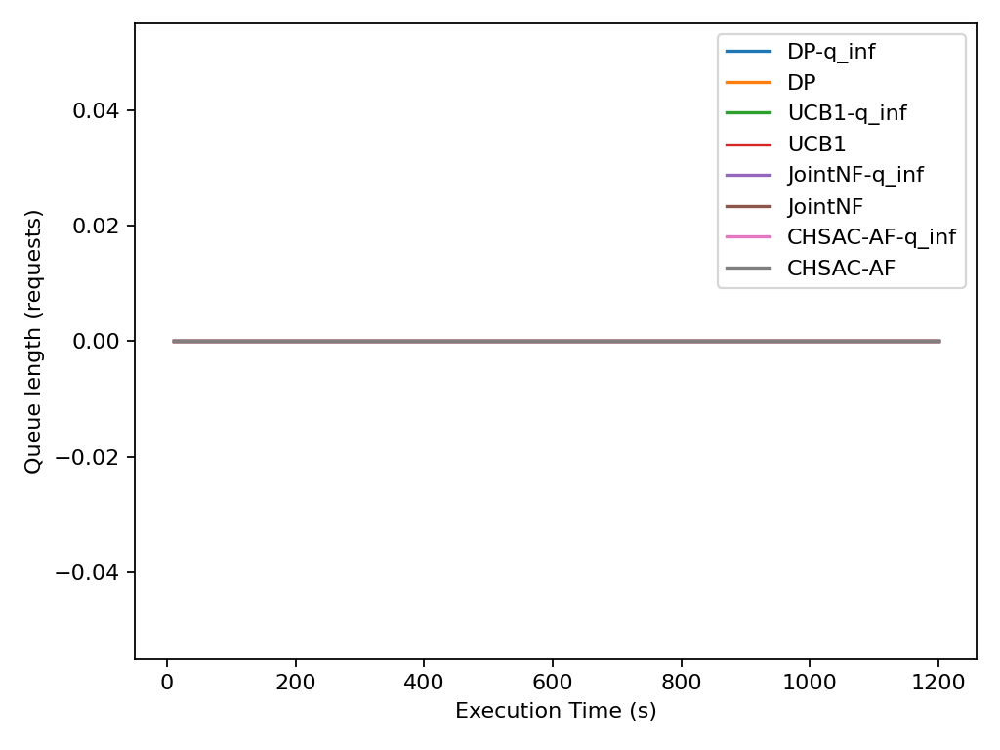

# Trace-Based Training & Evaluation

This document describes the methodology for using real-world workload traces (Alibaba PAI 2021) to train and evaluate the AI Agent, including a comparison between Trace-based and Synthetic workloads.

## 1. Trace Dataset (Alibaba PAI 2021)
We utilize the **PAI Job Duration Estimate (100K)** dataset to simulate realistic cloud workloads.
*   **Characteristics**: The data exhibits extreme **burstiness**. Jobs often arrive in massive clusters over short intervals, causing instantaneous resource bottlenecks.
*   **Challenge**: The legacy AI agent, trained on synthetic Poisson models, struggled with these real-world bursts because it couldn't anticipate the sudden spikes in demand.

## 2. Optimization Solutions for Traces
To handle the complexity of real-world traces, two major upgrades were implemented:

### A. AI Retraining
The `CHSAC-AF` agent was retrained directly on the arrival distributions of the Alibaba trace. This allows the agent to:
*   Learn the specific patterns of "data waves" and burst cycles.
*   Optimize its policy weights to react more effectively to both Training and Inference jobs in high-stress scenarios.

### B. Dynamic Quota (Preemption)
An **absolute priority mechanism for Inference** was implemented:
*   When an Inference job arrives and no GPUs are available, the Simulator automatically **preempts** (pauses) a running Training job.
*   The preempted Training job is checkpointed and automatically resumes once resources are freed.
*   **Result**: Minimizes inference latency without losing progress on lower-priority training tasks.

## 3. Experimental Results and Analysis

This section evaluates the performance of the proposed **CHSAC-AF** agent against three state-of-the-art baseline methods: **DP** (Default Policy), **UCB1** (Multi-armed Bandit based), and **JointNF** (Joint Optimization), under the extreme burstiness of the Alibaba PAI Trace.

### 3.1 System-wide Power Modulation Efficiency
Real-world traces exhibit violent spikes in job density. Figure 3.1 illustrates the total power consumption over time. **CHSAC-AF** demonstrates superior stability in power modulation, effectively dampening peak fluctuations compared to heuristic policies which suffer from significant power demand surges.



### 3.2 Stability of Resource Queuing under Bursts
Under extreme arrival waves, traditional policies (DP, JointNF) experience linear queue growth, leading to resource saturation. As shown below, our **Dynamic Preemption** mechanism ensures that high-priority Inference queues remain near-zero by intelligently pausing lower-priority training tasks.



### 3.3 Statistical Distribution of Service Quality (QoS)
To assess the reliability of service, we utilize a **Boxen Plot** to represent the statistical distribution of inference latency. While baselines exhibit high variance and "tail latency" risks, **CHSAC-AF** achieves a highly concentrated distribution at the lowest latency levels, ensuring a strictly guaranteed QoS.


### 3.4 Multi-objective Optimization: Energy-Latency Frontier
The scatter plot in Figure 3.4 demonstrates the trade-off between energy consumption per job and average latency. **CHSAC-AF** occupies the Pareto-optimal region (bottom-left), outperforming all baselines by achieving higher throughput with significantly lower operational overhead.


## 5. How to Run Trace Simulations

To run the simulator using the Alibaba trace data, follow these steps:

### A. Basic Trace Execution
Use the following command to run a standard simulation with trace arrivals:
```bash
python run_sim_paper.py --inf-mode trace --trn-mode trace --inf-trace workloads/dataset/pai_job_duration_estimate_100K.csv --trn-trace workloads/dataset/pai_job_duration_estimate_100K.csv --duration 1200
```

### B. Running with the Retrained AI Agent
To utilize the optimized `CHSAC-AF` agent with preemption enabled:
```bash
python run_sim_paper.py --inf-mode trace --trn-mode trace --inf-trace workloads/dataset/pai_job_duration_estimate_100K.csv --trn-trace workloads/dataset/pai_job_duration_estimate_100K.csv --algo chsac_af --duration 1200
```

### C. Key Parameters
- `--inf-mode trace`: Enables trace-based arrivals for inference.
- `--trn-mode trace`: Enables trace-based arrivals for training.
- `--inf-trace / --trn-trace`: Specifies the path to the CSV trace file.
- `--algo chsac_af`: Selects the retrained RL agent.
- `--duration`: Sets the simulation time in seconds.


