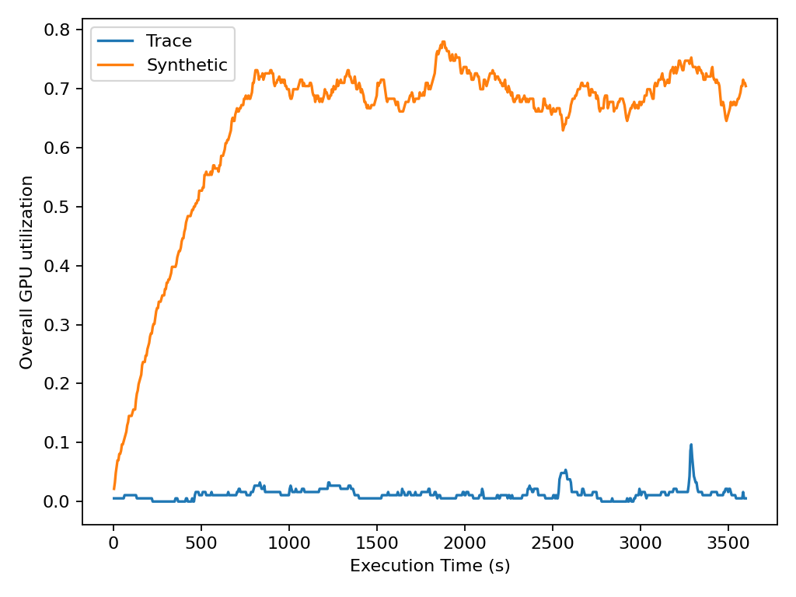
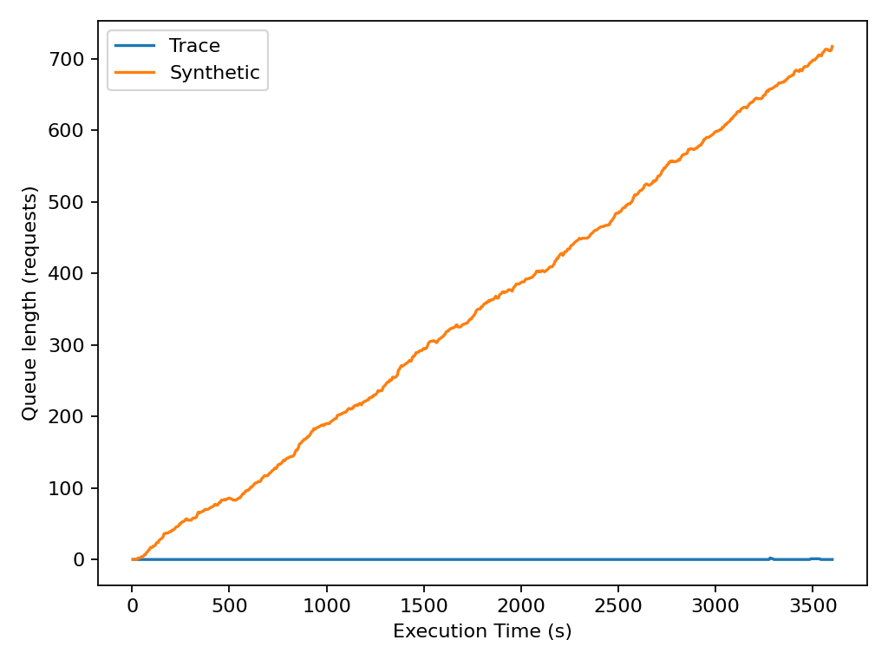
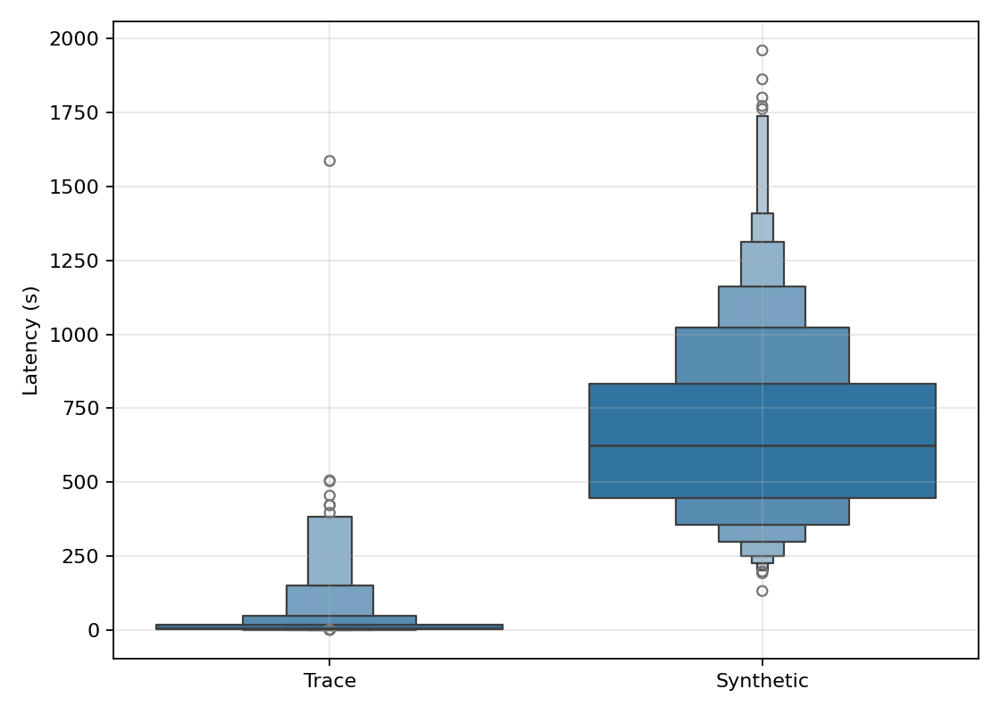
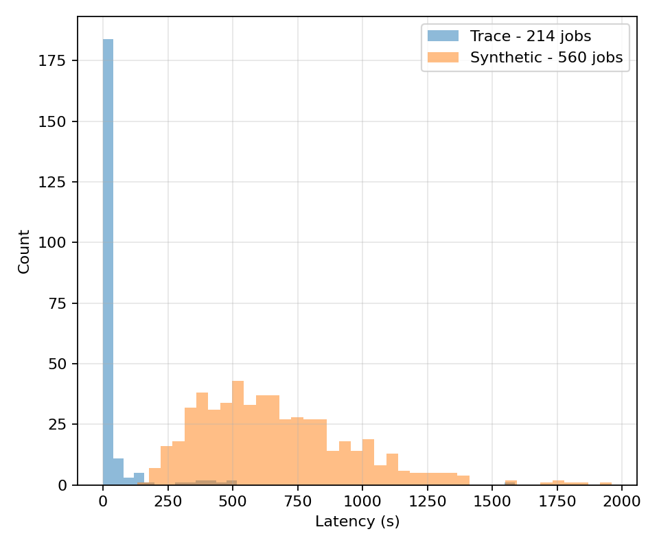
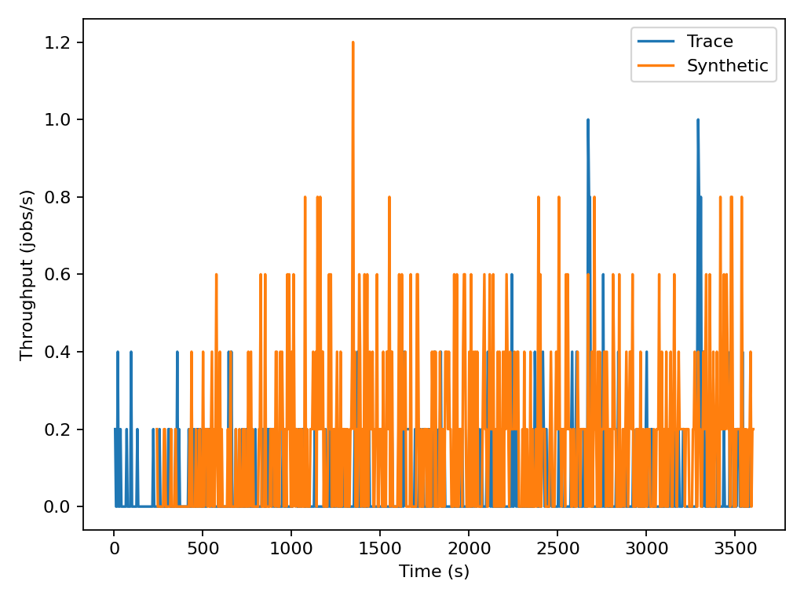
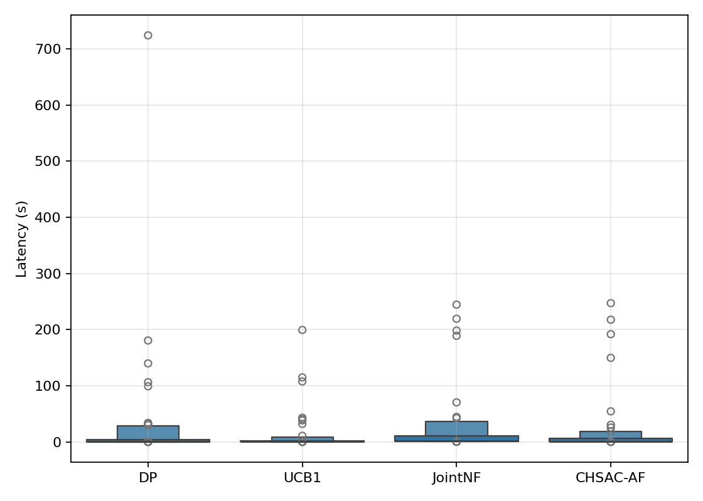
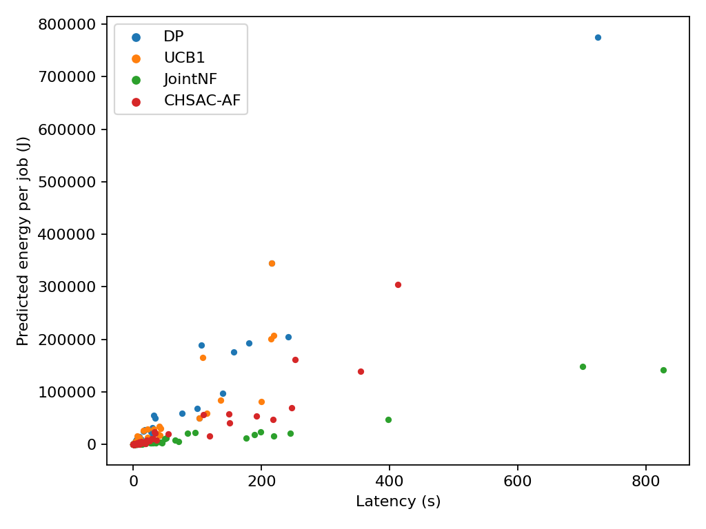

# Trace-Based Training & Evaluation

This document describes the methodology for using real-world workload traces (Alibaba PAI 2021) to train and evaluate the AI Agent, including a comparison between Trace-based and Synthetic workloads.

## 1. Trace Dataset (Alibaba PAI 2021)
We utilize the **PAI Job Duration Estimate (100K)** dataset to simulate realistic cloud workloads.
*   **Characteristics**: The data exhibits extreme **burstiness**. Jobs often arrive in massive clusters over short intervals, causing instantaneous resource bottlenecks.
*   **Challenge**: The legacy AI agent, trained on synthetic Poisson models, struggled with these real-world bursts because it couldn't anticipate the sudden spikes in demand.

## 2. Trace-Driven Methodology & Time Compression
To effectively evaluate the system over long-term historical traces within a constrained simulation window, we employ a **Time Compression** methodology using two independent scaling factors: $\alpha$ (Arrival Scaling) and $\beta$ (Duration Scaling).

### 2.1. Mathematical Formulation
The transformation from the original trace timestamps to the simulation events is governed by the following equations:

1. **Arrival Time Normalization & Scaling**:
$$T_{arrival}^{sim} = \frac{T_{arrival}^{trace} - T_{start}^{trace}}{\alpha}$$
Where:
- $T_{arrival}^{trace}$: The raw submission timestamp of a specific job, recorded as an absolute Unix epoch timestamp from the Alibaba dataset in 2021.
- $T_{start}^{trace}$: The absolute submission timestamp of the *very first job* in the loaded dataset sequence. This serves as a critical zero-offset mechanism, ensuring that the simulation always begins precisely at relative time $t_{sim}=0$, rather than propagating arbitrary historical offsets.
- $\alpha$: The **Arrival Scaling factor**. When $\alpha > 1$, the inter-arrival gap between consecutive jobs is compressed. This artificially condenses days of workload arrivals into hours or minutes, functioning as an intense "Stress Test" by increasing the density of the data waves.

2. **Execution Duration Scaling**:
$$T_{duration}^{sim} = \frac{T_{duration}^{trace}}{\beta}$$
Where:
- $T_{duration}^{trace}$: The empirically measured total execution time of the AI workload running on physical GPU hardware (e.g., NVIDIA V100 or P100) recorded in the trace.
- $\beta$: The **Duration Scaling factor**. This parameter linearly accelerates the simulated execution process. By setting $\beta \gg 1$, weeks of real-world computational workload can be processed by the simulator in fractions of a second. Crucially, as long as $\alpha = \beta$, the proportional concurrency ratio between incoming jobs and completing jobs remains strictly authentic to the physical Alibaba cluster.

## 3. Optimization Solutions for Traces
To handle the complexity of real-world traces, two major upgrades were implemented:

### A. AI Retraining
The `CHSAC-AF` agent was retrained directly on the arrival distributions of the Alibaba trace. This allows the agent to:
*   Learn the specific patterns of "data waves" and burst cycles.
*   Optimize its policy weights to react more effectively to both Training and Inference jobs in high-stress scenarios.

### B. Dynamic Quota (Preemption)
An **absolute priority mechanism for Inference** was implemented:
*   When an Inference job arrives and no GPUs are available, the Simulator automatically **preempts** (pauses) a running Training job.
*   The preempted Training job is checkpointed and automatically resumes once resources are freed.
*   **Result**: Minimizes inference latency without losing progress on lower-priority training tasks.

## 4. Workload Characterization: Trace vs. Synthetic Analysis

To empirically justify the necessity of trace-driven simulations, we conduct a baseline comparison between the real-world Alibaba trace and a theoretical Poisson distribution. Both simulations execute an identical volume of jobs using a static provisioning policy, with inference workloads disabled to isolate macroscopic training behavior.

### 4.1 Extreme Burstiness and Resource Utilization
Theoretical models inherently smooth out workload stochasticity. As demonstrated below, a Poisson arrival process maintains relatively stable, flat-lined GPU utilization. In stark contrast, the Alibaba trace exhibits extreme "burstiness"—sudden, localized spikes scaling rapidly from low idle states to near 100% hardware saturation within seconds. 



### 4.2 Spontaneous Queue Saturation
The consequence of workload burstiness is catastrophic queue buildup. While synthetic models predict manageable queuing delays, the empirical trace induces massive congestion spikes. Real-world clusters undergo severe "data waves" where incoming request rates vastly outpace completion rates, saturating system ingress and stressing scheduling algorithms.



### 4.3 Tail Latency Deterioration
The ultimate impact of unmanaged burstiness is exposed in the Quality of Service (QoS). The trace workload induces a significantly elongated and dense tail latency compared to the compact variance observed under synthetic loads. This empirical evidence proves that AI provisioning algorithms must be trained on authentic traces to properly manage outlier scenarios.




### 4.4 Latency Probability Distribution
To further analyze the quality of service, we examine the histograms of job latencies. Under the synthetic Poisson workload, the latencies are tightly grouped, reflecting a predictable system state. Conversely, the Trace workload induces a high-density "long tail" in the histogram, representing many jobs suffering from extreme delays due to the aforementioned burst spikes.



### 4.5 System Throughput Limits
The massive volatility in the workload also profoundly impacts system throughput (jobs completed per second). While a Poisson arrival process allows the system to process jobs at a steady, predictable throughput rate, the Alibaba trace stresses the system with extreme fluctuations. During spike periods, the scheduler drops or severely delays jobs, causing erratic throughput behavior that theoretical models fail to anticipate.



## 5. Algorithmic Evaluation against Baselines

This section evaluates the performance of the proposed **CHSAC-AF** agent against three state-of-the-art baseline methods: **DP** (Default Policy), **UCB1** (Multi-armed Bandit based), and **JointNF** (Joint Optimization), under the extreme burstiness of the Alibaba PAI Trace.

### 5.1 System-wide Power Modulation Efficiency
Real-world traces exhibit violent spikes in job density. Figure 5.1 illustrates the total power consumption over time. **CHSAC-AF** demonstrates superior stability in power modulation, effectively dampening peak fluctuations compared to heuristic policies which suffer from significant power demand surges.


### 5.2 Statistical Distribution of Service Quality (QoS)
To assess the reliability of service, we utilize a **Boxen Plot** to represent the statistical distribution of inference latency. While baselines exhibit high variance and "tail latency" risks, **CHSAC-AF** achieves a highly concentrated distribution at the lowest latency levels, ensuring a strictly guaranteed QoS even under trace burstiness.



### 5.3 Multi-objective Optimization: Energy-Latency Frontier
The scatter plot in Figure 5.3 demonstrates the trade-off between energy consumption per job and average latency. **CHSAC-AF** occupies the Pareto-optimal region (bottom-left), outperforming all baselines by achieving higher throughput with significantly lower operational overhead.



## 6. How to Run Trace Simulations

To run the simulator using the Alibaba trace data, follow these steps:

### A. Basic Trace Execution
Use the following command to run a standard simulation with trace arrivals:
```bash
python run_sim_paper.py --inf-mode trace --trn-mode trace --inf-trace workloads/dataset/pai_job_duration_estimate_100K.csv --trn-trace workloads/dataset/pai_job_duration_estimate_100K.csv --duration 1200
```

### B. Running with the Retrained AI Agent
To utilize the optimized `CHSAC-AF` agent with preemption enabled:
```bash
python run_sim_paper.py --inf-mode trace --trn-mode trace --inf-trace workloads/dataset/pai_job_duration_estimate_100K.csv --trn-trace workloads/dataset/pai_job_duration_estimate_100K.csv --algo chsac_af --duration 1200
```

### C. Key Parameters
- `--inf-mode trace`: Enables trace-based arrivals for inference.
- `--trn-mode trace`: Enables trace-based arrivals for training.
- `--inf-trace / --trn-trace`: Specifies the path to the CSV trace file.
- `--algo chsac_af`: Selects the retrained RL agent.
- `--duration`: Sets the simulation time in seconds.


